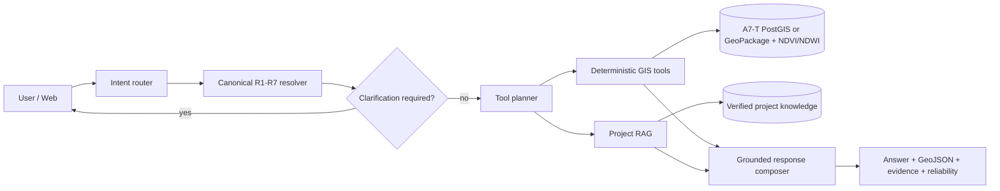

# AI Agent + GIS Tools + RAG architecture

## System boundary

The LLM is an optional spatial-intent parser (OpenAI Structured Outputs), enabled only with `AGENT_LLM_ENABLED=1` and a server-side `OPENAI_API_KEY`. It never receives database rows, emits SQL, or computes area, distance, intersection, NDVI or NDWI. Invalid/unavailable LLM output falls back to deterministic routing. The system remains operational without a key. Core spatial search, proximity, area filtering and GeoJSON retrieval use parameterized read-only PostGIS queries when `GEOAI_POSTGIS_DSN` is configured; otherwise they use the existing GeoPackage. A configured but unavailable PostGIS connection fails explicitly rather than silently mixing datasets.

## Canonical schema

`backend/config/class_schema.json` is authoritative. Spatial tools accept only `R1`-`R7`. Aliases translate natural language before GIS execution. Unsupported fine-grained labels return `clarification_required`; they never become new classes. R7 is explicitly a QA/uncertainty class.

## Agent flow

1. Classify `spatial`, `knowledge`, or `mixed` mode.
2. Resolve natural-language categories to canonical class IDs.
3. Parse area/distance values and units.
4. Stop for clarification when a required distance/class is missing.
5. Execute deterministic GIS tools.
6. Retrieve project knowledge when the query needs definitions, provenance, limitations, or reliability context.
7. Compose a grounded response with GeoJSON, evidence, reliability note, and a non-reasoning tool trace.

## GIS tools

- `search_landcover`
- `filter_by_area`
- `find_nearby`
- `calculate_distance`
- `intersects`
- `get_feature_details`
- `get_ndvi_stats`
- `get_ndwi_stats`
- `get_geojson`
- `get_evidence`

Full JSON contracts, validation rules and examples are in `agent_tools_v2.json` and `docs/AGENT_TOOL_CONTRACT.md`.

## RAG categories

- `land_cover_taxonomy`
- `model_metadata`
- `validation_limitations`
- `tool_api_documentation`

RAG explains facts and limitations. It is not used for spatial calculations or as a substitute for GIS.

## Reliability design

Every prediction-derived spatial result states that the source is A7-T model prediction, Fixed VAL4 is not independent validation, and class-level IoU/F1 are not polygon confidence. The API never labels the result as calibrated confidence.

## Fallback behavior

- `no_result`: valid query, no matching polygons.
- `clarification_required`: required class or distance is missing.
- `unsupported_class`: fine-grained category is outside Revised 7-class.
- `unavailable_data`: e.g. no spectral pixels for a geometry.
- `tool_error`: deterministic tool failed; technical detail remains structured/loggable.
- `invalid_parameter`: negative distance/area, bad unit, invalid geometry or invalid class.

## API endpoints

| Endpoint | Method | Purpose |
|---|---|---|
| `/api/schema/classes` | GET | Authoritative Revised-7 schema |
| `/api/schema/resolve` | GET | Resolve one alias without running GIS |
| `/api/agent/query` | POST | Full intent/GIS/RAG/reliability flow |
| `/api/spatial/search` | POST | Canonical class spatial search |
| `/api/spatial/near` | POST | Geometry-to-geometry proximity search |
| `/api/features/{id}` | GET | Feature detail and provenance |
| `/api/features/geojson` | POST | GeoJSON for explicit feature IDs |
| `/api/knowledge/search` | GET | Project KB retrieval |
| `/api/system/model-info` | GET | Frozen A7-T identity and limitations |

All existing V1 and `/api/geoai/*` endpoints remain available.

## Example queries

- `หาพื้นที่เกษตรกรรมที่อยู่ใกล้แหล่งน้ำไม่เกิน 300 เมตร`
- `หาพื้นที่เกษตรมากกว่า 5 ไร่ ใกล้น้ำไม่เกิน 300 เมตร`
- `R2 คืออะไร`
- `A7-T ใช้โมเดลอะไร`
- `TEST40 มี Ground Truth ไหม`
- `หาพื้นที่เกษตรใกล้น้ำ 300 เมตร แล้วผลนี้เชื่อถือได้แค่ไหน`

## Limitations

- Full AOI and TEST40 outputs are model predictions, not Ground Truth.
- TEST40 has no Ground Truth.
- Fixed VAL4 was reused during model development and is not an independent test.
- R7 has no support in Fixed VAL4, so no validation metric is reported for R7.
- The deterministic local pipeline does not require an LLM key. Remote LLM completion remains fail-closed until an approved provider integration is enabled.
# User-drawn AOI analysis (2026-09-20)

The agent capability surface now includes natural-language spatial search, knowledge and mixed queries, user-drawn AOI analysis, explainable GIS execution, reliability context, and human-in-the-loop correction. GIS measurements are executed by controlled backend functions; the LLM is not allowed to calculate area, raster statistics, class proportions, elevation, or SQL.

`POST /api/aoi/analyze` accepts validated GeoJSON in EPSG:4326 and runs the controlled sequence `calculate_aoi_area`, `get_class_distribution`, `get_ndvi_zonal_stats`, `get_ndwi_zonal_stats`, and `get_dem_zonal_stats` in EPSG:32647. The response includes a deterministic GIS-grounded summary when paid LLM summarization is not explicitly enabled. Execution trace exposes tool names, sources, status, CRS, and short result summaries only; it never exposes chain-of-thought.

Corrections are candidate annotations with `pending` review status. They are not Ground Truth and never modify the A7-T source raster.
